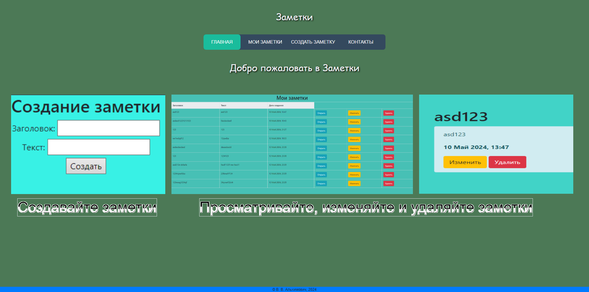
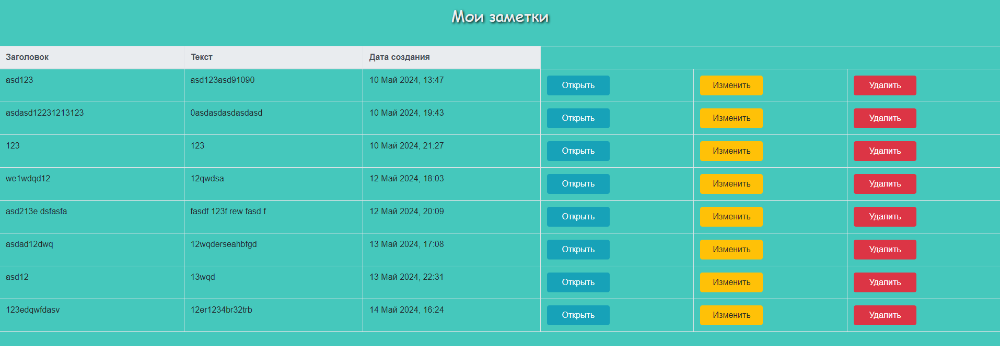
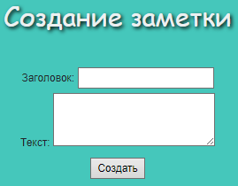
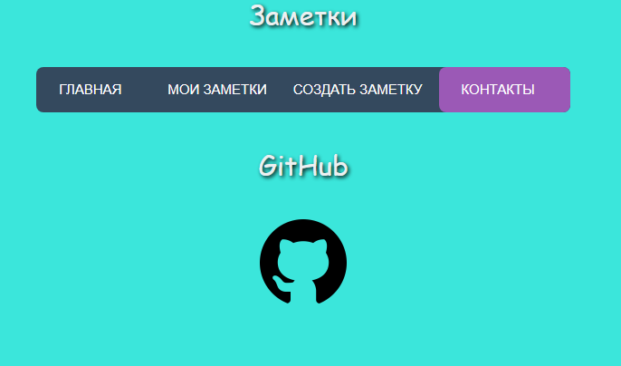

# Web-приложение "Заметки"

Приложение представляет собой сайт с четырьмя страницами: "Главная", "Мои заметки", "Создать заметку", "Контакты".

 
 
 
 
 


## Используемые библиотеки:

- Flask 
- Flask-WTF
- Flask-SQLAlchemy
- datetime
- locale

## Функционал сайта

- Просмотр таблицы заметок
- Форма добавления новой заметки
- Просмотр заметок
- Изменение и удаление заметок

## Запуск

Клонируйте репозиторий через среду разработки, либо скачайте архив проекта: зеленая кнопка "Code" -> "Download ZIP"
В случае, если необходимые библиотеки еще не установлены, выполните в Терминале:

```sh
pip install -r requirements.txt
```

Далее запустите исполняемый модуль app.py. Приложение размещается по адресу: 
```sh
http://127.0.0.1:5000/
```

## Изучение

Файлы html должны находится в папке "templates", файл базы данных в папке - "instance", файлы стилей и картинки - "static".
